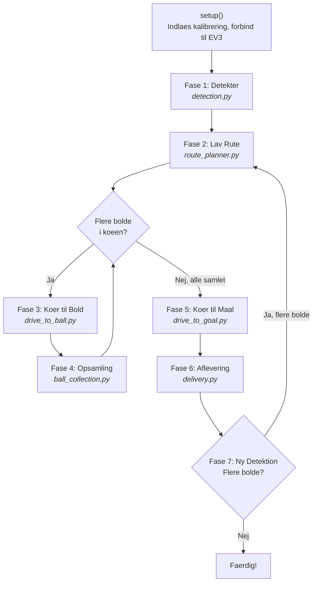

# Server Flow — Ny Arkitektur (Juni 2025)

> Denne fil beskriver det nye modulaere flow i `src/server/`.
> For den overordnede systemarkitektur (vision, robot, communication) se [arkitektur.md](arkitektur.md).

---

## Overblik

Serveren (PC-siden) styrer hele robottens adfaerd i **7 faser**.
Hver fase har sin egen fil og kan aendres uafhaengigt af de andre.



---

## Hvad goer hver fase?

### Fase 1 + 7: Detektion (`phases/detection.py`)
- Tager et billede med kameraet
- Finder robottens position (groenne + blaa markoer)
- Finder **alle** bolde paa banen (orange + hvide)
- Finder forhindringer (forberedt, ikke implementeret endnu)
- Returnerer et `DetectionResult` med alle positioner i cm

### Fase 2: Lav Rute (`phases/route_planner.py`)
- Modtager alle boldpositioner fra detektion
- Sorterer bolde i en prioritetskoee:
    - Orange bold foerst (200 bonuspoint)
    - Derefter taetteste bold foerst
 Returnerer en standard `deque` man kan loope igennem
- **Forberedt til A\***: Naar `pathfinder.py` implementeres, kan ruten tage hoejde for forhindringer
- Loebende korrektion via kamera (turn → verify → forward → verify)
- Praecisions-tilnaermelse naar robotten er taet paa
- Stopper foran bolden med korrekt vinkel og afstand
- **Forberedt til forhindringer**: TODO-kommentar viser praecis hvor A* skal saeettes ind

### Fase 4: Opsamling (`phases/ball_collection.py`)
- Starter transportbaandet (COLLECT_START)
- Koerer langsomt frem over bolden
- Markerer bolden som opsamlet i koeen
- Loopet i main.py koerer derefter til naeste bold

### Fase 5: Koer til Maal (`phases/drive_to_goal.py`)
- To-trins tilnaermelse for praecis indkoersel:
  1. Koer til et waypoint foran maalet (sikrer lige indkoersel)
  2. Koer direkte mod maalet
- Bruger de samme navigation-funktioner som Fase 3

### Fase 6: Aflevering (`phases/delivery.py`)
- Saetter transportbaand i reverse (COLLECT_EJECT)
- Venter paa at boldene triller ud
- Bakker vaek fra maalet

---

## Filstruktur

```
src/server/
│
├── main.py                  ← Dirigenten: kalder faserne i raekkefoelge
├── context.py               ← GameContext: delt hukommelse for alle faser
│
├── helpers/                 ← Hjaelpefunktioner (bruges af flere faser)
│   ├── camera_utils.py      ← Tag billede, find robot
│   ├── command_utils.py     ← Send kommando til EV3, tjek svar
│   ├── goal_utils.py        ← Indlaes maal, beregn waypoints
│   └── navigation.py        ← Drej, koer fremad, kalibrer heading
│
└── phases/                  ← En fil per fase
    ├── detection.py         ← Fase 1+7
    ├── route_planner.py     ← Fase 2
    ├── drive_to_ball.py     ← Fase 3
    ├── ball_collection.py   ← Fase 4
    ├── drive_to_goal.py     ← Fase 5
    └── delivery.py          ← Fase 6
```

---

## GameContext — Den delte hukommelse

Alle faser modtager et `ctx` (GameContext) objekt.
Det indeholder alt de har brug for:

```
GameContext
├── Hardware (konstant)
│   ├── camera          Kamera-forbindelse
│   ├── tracker         Robot-tracker (groenne+blaa markoer)
│   ├── ball_detector   Bold-detektor (orange+hvid)
│   ├── field_map       Pixel → cm konvertering
│   └── client          WiFi-forbindelse til EV3
│
├── Maal (konstant)
│   ├── goal_a_cm       Maal A koordinater i cm
│   ├── goal_b_cm       Maal B koordinater i cm
│   └── goal_a_waypoint Waypoint foran maal A
│
└── Navigation (dynamisk — aendrer sig under koersel)
    ├── estimated_heading   Robotens estimerede retning i grader
    └── iteration           Taeller for debug-output
```

**Fordelen**: Naar f.eks. Fase 3 opdaterer `ctx.estimated_heading` efter en drejning,
er den nye heading automatisk tilgaengelig for Fase 5 naar den skal koere til maal.

---

## Saadan aendrer du en specifik del

| Jeg vil... | Aaben denne fil |
|---|---|
| Aendre hvordan robotten koerer mod bolden | `phases/drive_to_ball.py` |
| Aendre raekkefoelgen af bolde | `phases/route_planner.py` |
| Tilfoeje A* pathfinding | `planning/pathfinder.py` + TODO i `route_planner.py` |
| Aendre opsamlingslogik | `phases/ball_collection.py` |
| Aendre afleveringslogik | `phases/delivery.py` |
| Aendre maal-navigation | `phases/drive_to_goal.py` |
| Aendre drejnings/koersel-logik | `helpers/navigation.py` |
| Tilfoeje ny config-variabel | `config.py` |

---

## Saadan ser main.py ud nu

```python
def main():
    ctx = setup()

    while True:
        # Fase 1: Detekter bolde og forhindringer
        balls = detect_balls(ctx)
        obstacles = detect_obstacles(ctx)

        # Fase 2: Lav rute (returnerer en standard deque)
        queue = plan_route(ctx, balls, obstacles)

        # Fase 3+4: Hent og opsaml bolde fra koeen
        while queue:
            ball = queue[0]
            drive_to_ball(ctx, ball)          # Fase 3
            collect_ball(ctx, ball, queue)    # Fase 4 (fjerner via popleft())

        drive_to_goal(ctx)                    # Fase 5
        deliver_balls(ctx)                    # Fase 6

        # Fase 7: Tjek om der er flere bolde
        balls = detect_balls(ctx)
        if not balls:
            break
```

> **130 linjer** i stedet for de gamle 415. Al logik er delegeret til faserne.
